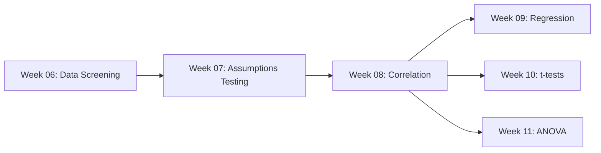

# Week 08: Correlation Analysis

## Lecture Materials

### Viewing the Presentations

This week has two HTML presentations covering correlation analysis and relationships between variables:

#### 1. Correlation Analysis (Lecture Slides)

**Option 1: View Online (GitHub Pages - Recommended)**
- [View Presentation Online](https://melhzy.github.io/data_sciences/ANLY500-Analytics-I/Week08/08_correlation.html)

**Option 2: Alternative Online Viewer**
- [View via htmlpreview](https://htmlpreview.github.io/?https://github.com/melhzy/data_sciences/blob/main/ANLY500-Analytics-I/Week08/08_correlation.html)

**Option 3: Download and Open Locally**
- Download `08_correlation.html` and open in your web browser

#### 2. R for Data Analytics (Week 08 Comprehensive Tutorial) 🆕 ⭐

**Option 1: View Online (GitHub Pages - Recommended)**
- [View Tutorial Online](https://melhzy.github.io/data_sciences/ANLY500-Analytics-I/Week08/08_R_for_DataAnalytics.html)

**Option 2: Alternative Online Viewer**
- [View via htmlpreview](https://htmlpreview.github.io/?https://github.com/melhzy/data_sciences/blob/main/ANLY500-Analytics-I/Week08/08_R_for_DataAnalytics.html)

**Option 3: Download and Open Locally**
- Download `08_R_for_DataAnalytics.html` and open in your web browser

---

## Course Content

This week introduces **correlation analysis**, examining relationships between two or more variables. Correlation is fundamental to understanding how variables covary and is the foundation for more advanced techniques like regression.

### Lecture Topics
- Understanding correlation coefficients and their interpretation
- Pearson's product-moment correlation (parametric)
- Non-parametric alternatives: Spearman's rho and Kendall's tau
- Point-biserial correlation for dichotomous variables
- Partial and semi-partial correlations
- Comparing dependent and independent correlations
- Effect sizes and practical significance
- APA-style reporting of correlation results
- Common pitfalls: correlation vs. causation, restriction of range, outliers

### R Tutorial Topics (Enhanced with 50+ Visualizations!)
- **Understanding Correlation**: Concepts, formulas, and visual intuition
- **Correlation Assumptions**: Linearity, normality, homoscedasticity, independence
- **R Functions Comparison**: `cor()`, `cor.test()`, `rcorr()` - when to use each
- **Pearson's r**: Implementation, interpretation, confidence intervals
- **Non-parametric Methods**: When and how to use Spearman and Kendall
- **Point-Biserial Correlation**: Relating continuous and binary variables
- **Partial Correlations**: Controlling for third variables with `ppcor` package
- **Semi-Partial Correlations**: Unique variance contribution analysis
- **Comparing Correlations**: Testing differences between correlation coefficients
- **Effect Sizes**: Cohen's guidelines and practical interpretation
- **Visualization**: Scatterplots, correlation matrices, corrplot heatmaps, ggpairs
- **Assumption Violations**: Anscombe's Quartet, outlier influence, curvilinear relationships
- **APA Reporting**: Complete examples with effect sizes and confidence intervals
- **Practice Exercises**: Three hands-on problems with detailed solutions

---

## Materials

- **Lecture Slides**: `08_correlation.rmd` → `08_correlation.html` (Slidy presentation)
- **R Tutorial**: `08_R_for_DataAnalytics.rmd` → `08_R_for_DataAnalytics.html` (2,700+ lines, comprehensive guide!)
- **Data Files**: `data/` folder
  - `exam_data.csv` - Exam anxiety and performance data (Pearson examples)
  - `liar_data.csv` - Creativity, position, and Novice scores (partial correlation examples)
- **Images**: `pictures/` folder (lecture graphics)
  - `9.png` - Correlation visualization examples

---

## Reading

- **Textbook**: Discovering Statistics Using R (Field et al., 2012)
  - **Chapter 6: Correlation** (pp. 265-298)
    - Section 6.1: What is a correlation?
    - Section 6.2: Data entry for correlation analysis
    - Section 6.3: Bivariate correlation
    - Section 6.4: Pearson's correlation coefficient
    - Section 6.4.1: Assumptions of Pearson's r
    - Section 6.4.2: Computing Pearson's r
    - Section 6.4.3: Using R to compute Pearson's r
    - Section 6.5: Spearman's correlation coefficient
    - Section 6.5.1: Bootstrap for correlations
    - Section 6.6: Kendall's tau (non-parametric correlation)
    - Section 6.7: Biserial and point-biserial correlations
    - Section 6.8: Partial correlation
    - Section 6.9: Semi-partial (part) correlations
    - Section 6.10: Comparing correlations
    - Section 6.11: Calculating the effect size
    - Section 6.12: How to report correlation coefficients
  
  Local reference file: `D:\Github\data_sciences\ANLY500-Analytics-I\Knowledge\Field_ea_2012_Discovering_Statistics_using_R_normalized.txt`

- **Additional References**:
  - Cohen, J., Cohen, P., West, S. G., & Aiken, L. S. (2003). *Applied Multiple Regression/Correlation Analysis for the Behavioral Sciences* (3rd ed.)
  - Hays, W. L. (1994). *Statistics* (5th ed.). Fort Worth, TX: Harcourt Brace
  - Howell, D. C. (2012). *Statistical Methods for Psychology* (8th ed.)

---

## Learning Path



**Prerequisites**: Weeks 06-07 (data screening and assumptions) are essential before correlation analysis.

**Next Steps**: Week 08 correlation is foundational for:
- Week 09: Simple and multiple regression (prediction)
- Week 10: t-tests and group comparisons
- Week 11: ANOVA (analysis of variance)

---

## Key R Packages

Install required packages before starting:

```r
# Core packages
install.packages("ggplot2")
install.packages("corrplot")
install.packages("GGally")
install.packages("Hmisc")

# Advanced correlation packages
install.packages("ppcor")      # Partial and semi-partial correlations
install.packages("cocor")      # Comparing correlation coefficients
install.packages("psych")      # Correlation matrices with p-values
```

---

## Learning Objectives

By the end of this week, you will be able to:

1. **Understand Correlation Concepts**
   - Define correlation and covariance
   - Interpret correlation coefficients (-1 to +1 scale)
   - Distinguish correlation from causation
   - Explain shared variance (r²)

2. **Choose Appropriate Methods**
   - Select Pearson's r for parametric data
   - Use Spearman's rho for ordinal or non-normal data
   - Apply Kendall's tau for small samples or tied ranks
   - Implement point-biserial for dichotomous variables

3. **Test Correlation Assumptions**
   - Verify linearity with scatterplots
   - Check normality of variables
   - Assess homoscedasticity in bivariate plots
   - Identify independence of observations

4. **Implement in R**
   - Use `cor()`, `cor.test()`, and `rcorr()` functions
   - Create correlation matrices with p-values
   - Generate professional scatterplots with `ggplot2`
   - Produce correlation heatmaps with `corrplot`

5. **Advanced Techniques**
   - Calculate partial correlations (controlling for third variables)
   - Compute semi-partial correlations (unique contributions)
   - Compare dependent and independent correlations
   - Test for significant differences between correlations

6. **Interpret and Report**
   - Calculate effect sizes (Cohen's guidelines: small 0.1, medium 0.3, large 0.5)
   - Report results in APA format with confidence intervals
   - Visualize correlations with professional graphics
   - Identify and handle problematic cases (outliers, restriction of range)

---

## Important Notes

### Correlation ≠ Causation
**Critical Warning**: A significant correlation does NOT imply causation. Third variables (confounds) can create spurious correlations. Always consider:
- Temporal precedence (which came first?)
- Alternative explanations (other variables?)
- Theoretical plausibility (does it make sense?)

### Assumption Violations
**Common Issues**:
- **Outliers**: A single extreme value can drastically change r
- **Curvilinear relationships**: Pearson's r only detects linear relationships
- **Restriction of range**: Limited variability underestimates true correlation
- **Heteroscedasticity**: Unequal variance can indicate non-linear patterns

**Solutions**: Use robust methods (Spearman/Kendall), remove outliers with justification, transform variables, or use non-linear techniques.

### Effect Size Interpretation
Cohen's conventional guidelines for |r|:
- **Small effect**: r = 0.10 (1% shared variance)
- **Medium effect**: r = 0.30 (9% shared variance)
- **Large effect**: r = 0.50 (25% shared variance)

Remember: These are *rules of thumb*. In some fields, r = 0.20 is substantial; in others, r = 0.70 is expected.

---

## Practice Datasets

### exam_data.csv
Variables for practicing Pearson's correlation:
- **Revise**: Hours spent revising for exam
- **Exam**: Exam performance score (%)
- **Anxiety**: Exam anxiety level

**Research Question**: Is exam anxiety related to exam performance?

### liar_data.csv
Variables for practicing partial correlation:
- **Creativity**: Creativity test score
- **Position**: Social position/status rating
- **Novice**: Novice creativity rating (dichotomous)

**Research Question**: Is creativity related to position after controlling for novice status?

---

## Assessment

This week's materials prepare you for:
- Understanding correlation output in research papers
- Conducting correlation analyses for your final project
- Recognizing when correlation is appropriate vs. inappropriate
- Reporting correlation results professionally

---

## Getting Help

### Common Errors and Solutions

**"Error: object not found"**
- Solution: Load data with `rio::import("data/filename.csv")`
- Check spelling of variable names with `str(data)`

**"Warning: the standard deviation is zero"**
- Solution: Variable has no variance (all same value)
- Check with `summary(data$variable)`

**"Pearson's r is 0 but I see a pattern"**
- Solution: Relationship is non-linear (curvilinear)
- Try Spearman's rho or visualize with scatterplot

**"Different functions give different p-values"**
- Solution: Check if two-tailed vs. one-tailed test
- Verify sample size and missing data handling

### Resources
- **RStudio Help**: Type `?cor` or `?cor.test` in console
- **Tutorial**: Work through `08_R_for_DataAnalytics.html` step-by-step
- **Textbook**: Field et al. (2012) Chapter 6, pp. 265-298
- **Office Hours**: Bring specific questions about correlation output

---

## Week Structure

- **Monday-Tuesday**: Watch lecture slides (`08_correlation.html`)
- **Wednesday-Thursday**: Work through R tutorial (`08_R_for_DataAnalytics.html`)
- **Friday-Sunday**: Complete lab assignment (if assigned)
- **Throughout Week**: Practice with exam_data.csv and liar_data.csv

---

## Navigation

- **Previous**: [Week 07 - Data Screening Part 2](../Week07/README.md)
- **Next**: Week 09 - Simple Regression (Coming Soon)
- **Course Home**: [ANLY500 Analytics I](../README.md)

---

## Quick Start Guide

### For Visual Learners
1. Start with correlation visualization in `08_R_for_DataAnalytics.html` Part 1
2. Examine Anscombe's Quartet examples (Part 11)
3. Look at corrplot heatmaps and ggpairs matrices
4. Work through scatterplot examples

### For Hands-On Learners
1. Load exam_data.csv in RStudio
2. Create scatterplot: `plot(data$Anxiety, data$Exam)`
3. Calculate correlation: `cor.test(data$Anxiety, data$Exam)`
4. Try tutorial exercises in Part 13

### For Theory Learners
1. Read Field Chapter 6 (pp. 265-298)
2. Watch lecture slides for conceptual overview
3. Focus on assumptions and interpretation sections
4. Study APA reporting guidelines

### For Applied Researchers
1. Jump to Part 10 (APA Reporting) in tutorial
2. Review effect size interpretation (Part 9)
3. Study partial correlation examples (Part 7)
4. Practice with your own data

---

*Last Updated: January 22, 2026*
